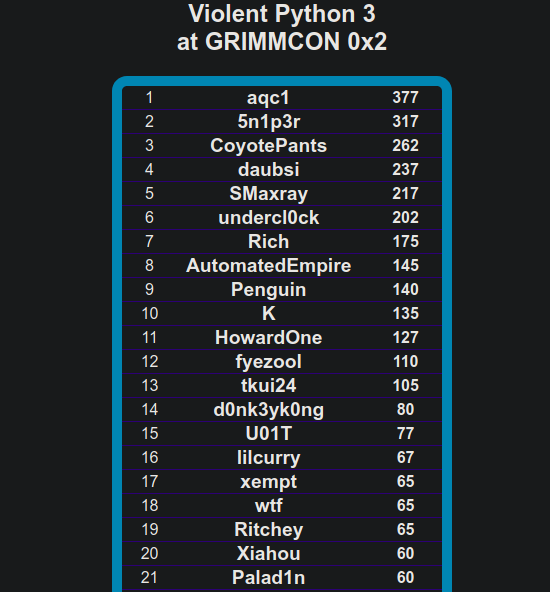

## Violent Python CTF
Weaponizing Python for Red Teaming and Pentesting exercise. 
Using awesome python libraries and few security tools such as Burpsuite

## Objective
CTF hosted in conjunction with GrimCon by college professor to encourage and gave security training to students and security enthusiast

## Resources
- Violent Python book
- https://samsclass.info
